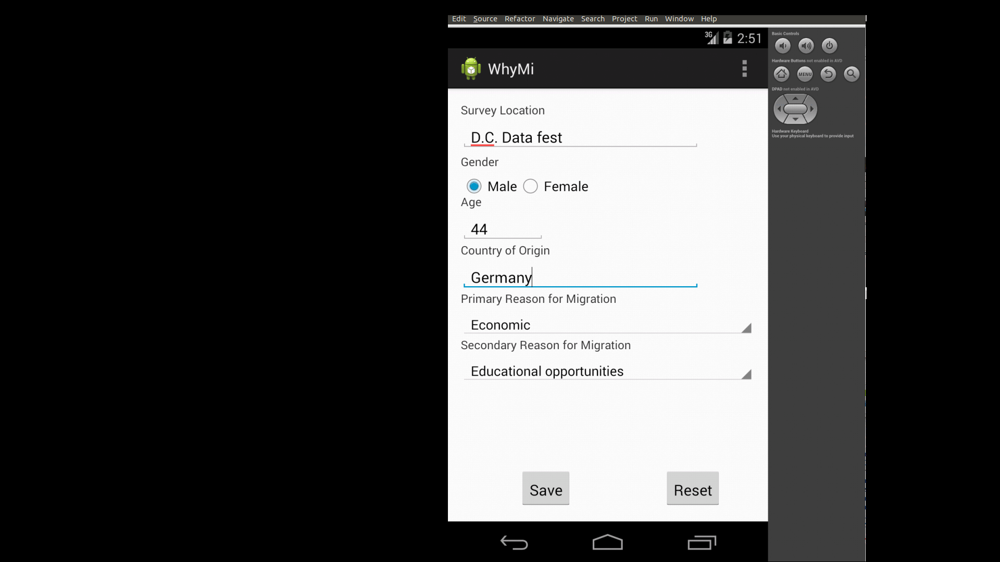

WhyMi
=====

America's Data Fest app

# WhyMi Android App

## Goal:

Build an Android application to quickly collect
basic demographic information at shelters or
detention centers.

### Survey content

* Survey location
* Gender
* Age
* Country of origin
* Main reason for migration (select only one):
    * Economic
    * Educational opportunities
    * Political persecution
    * Violence/Organized Crime
    * Family reunification
    * Other

Secondary reasons for migration (same as above)

# Design/background implementation
WhyMi saves all data to an Android-local sqlite
database. Longer term (not yet implemented) this
content is to be published via a RESTful web service
to a web-based interface that can capture the information
in a more centralized database for further analytical
processing.

# Still TODO
* Build RESTful data storage service
* Enable multi-language

# Screenshots
* 
* 
